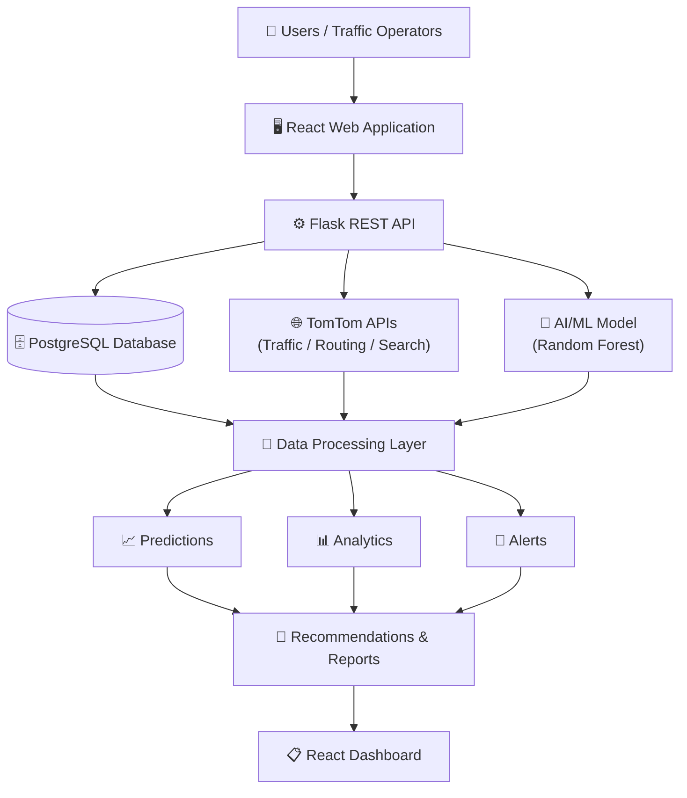
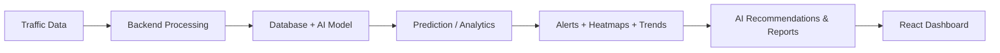
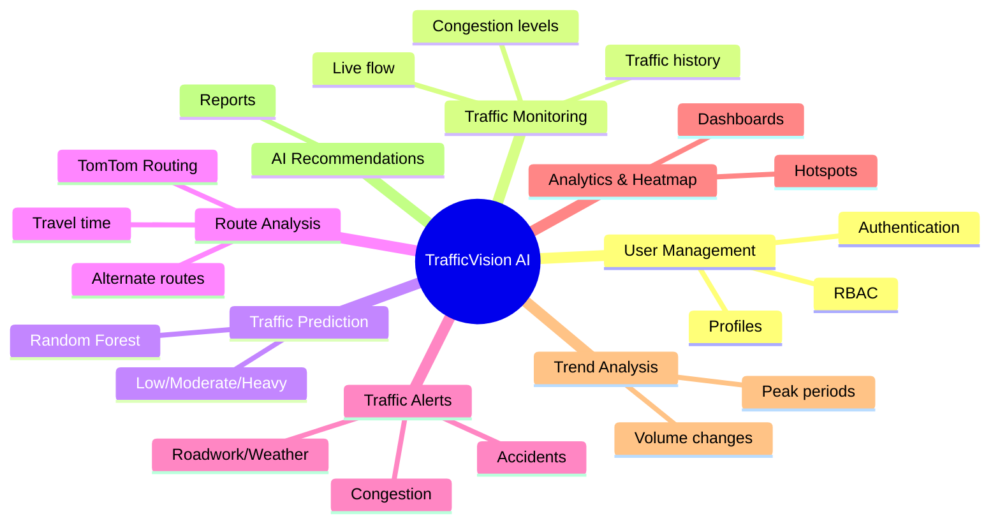
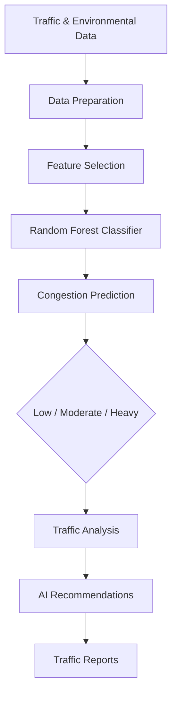
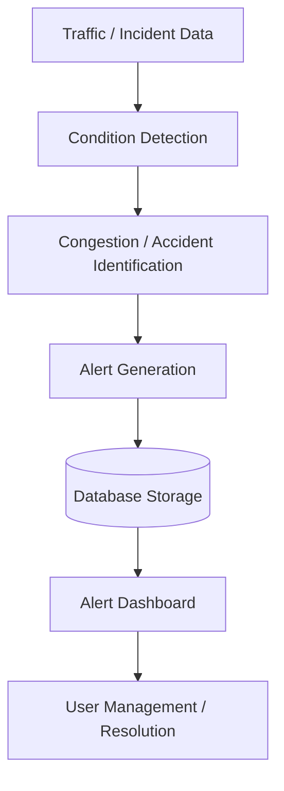
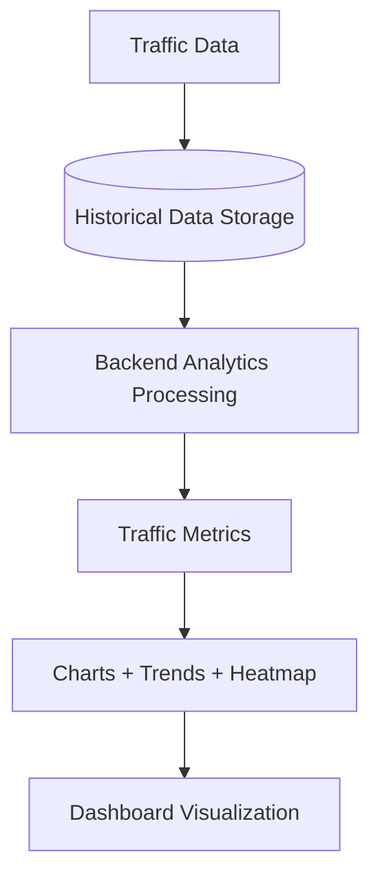

<div align="center">

# 🚦 TrafficVision AI

### Smart Traffic Prediction & Congestion Management System

*An AI-powered platform that turns raw traffic data into live monitoring, predictive insight, and actionable route intelligence.*


</div>

---

## 📑 Table of Contents

1. [Objective](#-1-objective)
2. [Project Outcomes](#-2-project-outcomes)
3. [Architecture Overview](#-3-architecture-overview)
4. [Technology Stack](#-4-technology-stack)
5. [Project Structure](#-5-project-structure)
6. [System Modules](#-6-system-modules)
7. [AI / ML Workflow](#-7-ai--machine-learning-workflow)
8. [Milestone-wise Implementation](#-8-milestone-wise-implementation)
9. [Evaluation Criteria](#-9-evaluation-criteria)
10. [Setup Guide](#-10-setup-guide)
11. [API Overview](#-11-api-overview)
12. [Testing Performed](#-12-testing-performed)
13. [Performance Metrics](#-13-performance-metrics)
14. [Scope, Limitations & Roadmap](#-14-scope-limitations--roadmap)
15. [Team](#-15-team)

---

## 🎯 1. Objective

TrafficVision AI is built to give traffic authorities and operators a **single control-room view** of city traffic — combining real-time feeds, historical patterns, and machine learning to answer three questions at once: *What's happening now? What's about to happen? What should we do about it?*

| Capability | What it delivers |
|---|---|
| 🛰️ Live Monitoring | Real-time traffic flow, speed, and congestion levels |
| 🔮 Congestion Prediction | ML-driven forecasts (Low / Moderate / Heavy) |
| 📊 Trend Analysis | Historical patterns, peak-hour detection |
| 🗺️ Route Intelligence | Traffic-aware routing & alternate route suggestions |
| 🚨 Alerting | Congestion, accident, roadwork & weather notifications |
| 🌡️ Heatmaps | Interactive visual congestion hotspots |
| 🤖 AI Recommendations | Synthesized insights and auto-generated reports |
| 🔐 Access Control | Role-based auth for admins & operators |

> **Insight:** The system's core value isn't any single feature — it's the *feedback loop* it closes: live data → prediction → alerting → analytics → recommendation, all feeding back into better-informed traffic decisions.

---

## ✅ 2. Project Outcomes

- ✅ AI-powered traffic prediction & congestion management platform
- ✅ JWT authentication with role-based access control
- ✅ Live traffic monitoring workflows
- ✅ Random Forest–based congestion prediction model
- ✅ Historical trend analysis engine
- ✅ Alert & notification pipeline (congestion + accidents)
- ✅ Analytics dashboards with congestion heatmaps
- ✅ Route analysis with alternate route recommendations
- ✅ Traffic-aware travel time estimation
- ✅ TomTom (Search, Traffic Flow, Routing) + OpenStreetMap/Nominatim integration
- ✅ AI-generated traffic recommendations and reports

---

## 🏗️ 3. Architecture Overview

The platform follows a **layered architecture**: a React client talks to a Flask API, which orchestrates data from PostgreSQL, external TomTom APIs, and an in-process ML model — then feeds unified results back to the dashboard.



### End-to-End Data Flow



> **Insight:** Notice the pipeline is unidirectional but **cyclical over time** — each new batch of traffic data re-triggers prediction, which reshapes alerts and analytics, which in turn reshapes the recommendations shown next cycle. This is what makes the dashboard feel "live" rather than static.

---

## 🧰 4. Technology Stack

<table>
<tr><th>Layer</th><th>Technology</th></tr>
<tr><td colspan="2"><b>Frontend</b></td></tr>
<tr><td>Framework</td><td>React.js 18</td></tr>
<tr><td>Build Tool</td><td>Vite</td></tr>
<tr><td>Styling</td><td>Tailwind CSS</td></tr>
<tr><td>Routing</td><td>React Router</td></tr>
<tr><td>Charts</td><td>Recharts</td></tr>
<tr><td>Maps</td><td>React-Leaflet</td></tr>
<tr><td>Geo Data</td><td>OpenStreetMap / Nominatim</td></tr>
<tr><td>HTTP Client</td><td>Axios</td></tr>
<tr><td colspan="2"><b>Backend</b></td></tr>
<tr><td>Framework</td><td>Python / Flask</td></tr>
<tr><td>Authentication</td><td>JWT / Flask-JWT-Extended</td></tr>
<tr><td>ORM</td><td>Flask-SQLAlchemy</td></tr>
<tr><td>Password Security</td><td>Flask-Bcrypt</td></tr>
<tr><td colspan="2"><b>Data & ML</b></td></tr>
<tr><td>Database</td><td>PostgreSQL / SQLite</td></tr>
<tr><td>Machine Learning</td><td>Scikit-learn</td></tr>
<tr><td>ML Algorithm</td><td>Random Forest Classifier</td></tr>
<tr><td>Data Processing</td><td>Pandas / NumPy</td></tr>
<tr><td colspan="2"><b>External Services</b></td></tr>
<tr><td>Traffic APIs</td><td>TomTom Search / Traffic Flow / Routing</td></tr>
<tr><td colspan="2"><b>DevOps</b></td></tr>
<tr><td>Containerization</td><td>Docker / Docker Compose</td></tr>
<tr><td>Version Control</td><td>Git / GitHub</td></tr>
<tr><td>IDE</td><td>VS Code</td></tr>
</table>

---

## 📂 5. Project Structure

```text
TrafficVision_Infosys_project/
│
├── backend/
│   ├── app.py                      # Flask entry point
│   ├── config.py                   # App configuration
│   ├── extensions.py               # Flask extensions init
│   ├── seed.py                     # DB seeding script
│   ├── requirements.txt
│   │
│   ├── models/                     # SQLAlchemy models
│   │   ├── alert.py
│   │   ├── prediction.py
│   │   ├── report.py
│   │   ├── route.py
│   │   ├── settings.py
│   │   ├── traffic.py
│   │   └── user.py
│   │
│   ├── routes/                     # API route blueprints
│   │   ├── alerts.py
│   │   ├── analytics.py
│   │   ├── auth.py
│   │   ├── prediction.py
│   │   ├── profile.py
│   │   ├── reports.py
│   │   ├── routes_bp.py
│   │   ├── settings.py
│   │   ├── traffic.py
│   │   └── users.py
│   │
│   ├── services/
│   │   └── tomtom_service.py       # TomTom API integration
│   │
│   ├── ml/                         # Machine learning pipeline
│   │   ├── generate_training_data.py
│   │   ├── train_model.py
│   │   ├── predictor.py
│   │   ├── training_data.csv
│   │   ├── traffic_model.pkl
│   │   ├── label_encoder.pkl
│   │   └── feature_columns.json
│   │
│   └── utils/
│       ├── decorators.py
│       └── validators.py
│
├── frontend/
│   └── src/
│       ├── components/
│       ├── context/
│       ├── pages/
│       ├── routes/
│       ├── services/
│       ├── App.jsx
│       ├── main.jsx
│       └── index.css
│
├── database/
│   └── schema.sql
│
├── models/                         # Deployed model artifacts
│   ├── traffic_model.pkl
│   ├── label_encoder.pkl
│   └── feature_columns.json
│
├── docker-compose.yml
├── .env.example
├── .gitignore
└── README.md
```

---

## 🧩 6. System Modules



### 6.1 👤 User Management Module
Secure authentication and administration.
- Admin & operator login · JWT authentication · Role-based access control
- User creation, status management & profile/password management

### 6.2 📡 Traffic Monitoring Module
Real-time visibility into current conditions.
- Live traffic flow, congestion level & average speed
- Road-based and vehicle-level traffic information
- Traffic history + interactive map view

### 6.3 🔮 Traffic Prediction Module
A **Random Forest Classifier** (Scikit-learn) predicts congestion using:

| Feature category | Fields |
|---|---|
| Temporal | Hour, Day of week, Month |
| Environmental | Temperature, Rain, Snow, Cloud coverage |
| Traffic | Vehicle count, Vehicle speed, Congestion percentage |

Output classes: **Low · Moderate · Heavy** — feeding directly into analytics and AI recommendations.

### 6.4 🗺️ Route Analysis Module
Traffic-aware routing powered by the TomTom Routing API.
- Source/destination selection · route calculation · travel time estimation
- Traffic-aware routing · alternate route recommendations · route comparison
- Route history & saved routes

### 6.5 🚨 Traffic Alert Module
Detects and manages significant traffic events.
- Congestion, accident, roadwork & weather-related alerts
- Severity & status tracking · filtering · resolution workflow

### 6.6 📊 Analytics & Heatmap Module
Turns raw data into visual insight.
- Traffic statistics, congestion summaries, volume analysis
- High-congestion area identification via interactive heatmaps
- Analytics charts and historical insights

### 6.7 📈 Traffic Trend Analysis Module
Historical pattern discovery: peak/low traffic periods, congestion trends, average speed trends, and volume changes — visualized via charts and analytical summaries.

### 6.8 🤖 AI Recommendation & Report Module
Synthesizes **predictions + analytics + trends + incidents + routes** into actionable recommendations and generated traffic reports.

---

## 🧠 7. AI / Machine Learning Workflow



> **Insight:** Random Forest was chosen over deeper models for a reason worth calling out — it handles the *mixed* feature types here (categorical time fields + continuous weather/traffic fields) natively, trains fast on modest data, and stays interpretable enough to explain *why* a congestion level was predicted — important for an operational tool traffic staff need to trust.

### Traffic Alert Workflow



### Analytics Workflow



---

## 🏁 8. Milestone-wise Implementation

```mermaid
gantt
    title TrafficVision AI — 8-Week Delivery Plan
    dateFormat  X
    axisFormat Week %s
    section Milestone 1
    Core Setup & Auth           :m1, 0, 2
    section Milestone 2
    Prediction & Routing        :m2, 2, 2
    section Milestone 3
    Alerts, Analytics, AI       :m3, 4, 2
    section Milestone 4
    Testing & Deployment        :m4, 6, 2
```



### Milestone 1 — Weeks 1–2 · Project Initialization, Design & Core Setup
- Project objectives & traffic workflows defined
- System architecture and database schema
- Frontend/backend scaffolding, authentication, RBAC
- Live traffic monitoring & congestion tracking workflows

**Outcome:** Foundation established — auth, DB connectivity, live monitoring, congestion tracking.

### Milestone 2 — Weeks 3–4 · Traffic Prediction & Route Optimization
- Random Forest-based traffic prediction model + history
- TomTom traffic API integration
- Route calculation, alternate routes, travel time estimation, traffic-aware routing

**Outcome:** Working ML-driven prediction and route analysis system.

### Milestone 3 — Weeks 5–6 · Alerts, Analytics & AI Insights

| Task | Description |
|---|---|
| 1. Traffic Alert System | Monitoring & management workflow for key traffic conditions |
| 2. Congestion/Accident Notifications | Notification generation for heavy congestion & accidents |
| 3. Analytics & Heatmap Dashboard | Stats, charts, congestion summaries, hotspot heatmaps |
| 4. Traffic Trend Analysis | Historical pattern, peak-period & volume trend detection |
| 5. AI Recommendations & Reports | ML + analytics + trends + incidents → recommendations & reports |

**Outcome:** End-to-end alert, notification, analytics, heatmap, trend, and AI reporting workflows completed.

### Milestone 4 — Weeks 7–8 · Testing, Deployment & Documentation
- Application testing & workflow validation
- UI responsiveness & performance optimization
- Final documentation, presentation, and end-to-end demo

**Outcome:** Fully validated, documented, and demonstrated TrafficVision AI platform.

---

## 📋 9. Evaluation Criteria

<details>
<summary><b>Milestone 1</b></summary>

- [x] Project initialization completed
- [x] System architecture and database setup completed
- [x] Authentication implemented
- [x] Traffic monitoring workflow implemented
- [x] Congestion tracking implemented
</details>

<details>
<summary><b>Milestone 2</b></summary>

- [x] Traffic prediction implemented
- [x] Congestion prediction implemented
- [x] Route analysis implemented
- [x] Alternate route recommendations implemented
- [x] Traffic APIs integrated
- [x] Travel time estimation implemented
</details>

<details>
<summary><b>Milestone 3</b></summary>

- [x] Traffic alert system implemented
- [x] Congestion and accident notifications implemented
- [x] Analytics dashboard implemented
- [x] Heatmap visualization implemented
- [x] Traffic trend analysis implemented
- [x] AI-based recommendations implemented
- [x] Traffic reports implemented
</details>

<details>
<summary><b>Milestone 4</b></summary>

- [ ] Application testing completed
- [ ] Workflow validation completed
- [ ] UI optimization completed
- [ ] Documentation prepared
- [ ] Final presentation prepared
- [ ] End-to-end demonstration completed
</details>

---

## ⚙️ 10. Setup Guide

### 10.1 Database Setup

Using Docker Compose:
```bash
docker compose up -d
```
Or configure an existing PostgreSQL server via the `DATABASE_URL` environment variable.

### 10.2 Backend Setup
```bash
cd backend

# Create virtual environment (Windows)
python -m venv venv
venv\Scripts\activate

# Install dependencies
pip install -r requirements.txt

# Create environment file
copy ..\.env.example ..\.env
# → configure the required environment variables

# Optional: seed the database
python seed.py

# Start the Flask backend
flask --app app run --port 5000
```

### 10.3 AI Model Setup

Trained Random Forest artifacts are included, but can be regenerated:
```bash
cd backend/ml
python generate_training_data.py   # rebuild training data
python train_model.py              # retrain the model
```
This produces:
- `traffic_model.pkl`
- `label_encoder.pkl`
- `feature_columns.json`

### 10.4 TomTom API Configuration

Traffic and routing features require a TomTom API key in `.env`:
```env
TOMTOM_API_KEY=your_api_key
```

Used for **Search**, **Traffic Flow**, and **Routing** services.

> **Design note:** If the API key is missing, the application surfaces a clear *"unavailable / not configured"* state rather than fabricating live traffic data — a deliberate reliability choice over a cosmetic one.

### 10.5 Frontend Setup
```bash
cd frontend
npm install
npm run dev
```
The frontend runs on Vite and communicates with the Flask REST API.

---

## 🔌 11. API Overview

| Module | Main Functions |
|---|---|
| **Authentication** | Login, refresh token, logout, current user |
| **Users** | User creation, update, status and management |
| **Traffic** | Traffic search, current traffic, history, road data |
| **Prediction** | Congestion prediction and prediction history |
| **Routes** | Route calculation, saved routes, route history |
| **Alerts** | Create, read, resolve, delete alerts |
| **Analytics** | Dashboard summary, analytics, heatmap data |
| **Reports** | Traffic report generation and report data |
| **Profile** | User profile management |
| **Settings** | User and system settings |

---

## 🧪 12. Testing Performed

- Backend application startup & API endpoint functionality
- User authentication & JWT flow · role-based access control
- Traffic data retrieval & prediction (Random Forest model)
- Route calculation · alert creation and management
- Analytics dashboard · heatmap visualization
- Traffic history & trend analysis · traffic reports
- Frontend application build

> Testing was performed through local development workflows to validate the major system features end-to-end.

---

## 📈 13. Performance Metrics

| Area | Metrics Tracked |
|---|---|
| **Traffic Prediction** | Congestion classification accuracy · prediction confidence · detection performance |
| **Analytics** | Dashboard response time · heatmap generation time · historical data processing · chart rendering |
| **System** | API response time · database query performance · authentication performance · frontend responsiveness |

### Example Quantitative Goals

| Goal | Target Outcome |
|---|---|
| Traffic Monitoring | Generate useful real-time traffic & congestion insights |
| Route Optimization | Reliable alternate routes & travel time estimation |
| Traffic Prediction | Predict congestion & peak conditions via ML |
| Analytics | Meaningful trends, heatmaps, and historical insight |
| Platform Performance | Stable monitoring & analytics workflows |

---

## 🔭 14. Scope, Limitations & Roadmap

The current implementation focuses on **software-based** traffic monitoring, prediction, analytics, alerts, route analysis, and AI recommendations — without live camera feeds or physical infrastructure integration.

### Planned Future Enhancements

```mermaid
flowchart LR
    subgraph Now["✅ Current Scope"]
        A1[Software-based monitoring]
        A2[ML congestion prediction]
        A3[Route & alert workflows]
    end
    subgraph Next["🚀 Future Enhancements"]
        B1[Real CCTV / camera feeds]
        B2[Computer vision vehicle detection]
        B3[Deep learning forecasting]
        B4[Automatic signal optimization]
        B5[Mobile application]
        B6[Cloud deployment]
        B7[Real-time push notifications]
        B8[Automated PDF reports]
    end
    Now -.extends to.-> Next
```



These extensions are designed to layer onto the existing architecture **without requiring a redesign** of the core system.

---

## 👥 15. Team

| Name | Email |
|---|---|
| Asvitha J | asvitha.28csa@licet.ac.in |
| Barigala Shainy | shainysureshb@gmail.com |
| Maharshini | maharshini01@gmail.com |
| Pavan S | spavannalini29225@gmail.com |
| Hemamrutha M P | hemamruthamp2005@gmail.com |
| Shreya Samal | shreysamal101@gmail.com |
| Dibita Biswas | dibitabiswas4@gmail.com |

---

## 🏁 Conclusion

TrafficVision AI brings together **real-time traffic services, historical data, machine learning, route analysis, alerting, analytics, heatmaps, trend analysis, and AI-generated recommendations** into one coherent platform for understanding and managing traffic conditions.

It's a practical demonstration of how AI/ML, modern web development, relational databases, external APIs, geographic visualization, and data analytics come together to solve a real, everyday urban problem — **smarter, calmer traffic.**

</div>
